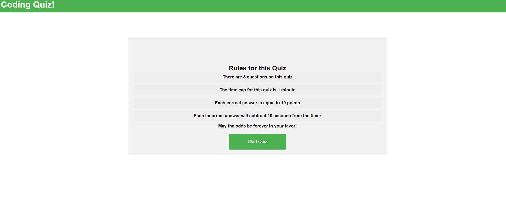

# Coding Quiz

## Desciption
A timed coding quiz with multiple-choice questions

I started this project by walking through the create a quiz on kindson the genius website and later worked with a few tutors to build upon it.  I was never able to get it working - the timer function seemed to be the problem as it worked until I started adding that feature - I ran out of time to try and debug.  

## Table of Contents
>* Mock-Up
>* Usage
>* Credits
>* License

## Mock-up

>Link to site: [Coding Pop Quiz](https://matty-bamboo.github.io/pop-quiz).

## Usage
N/A

## Credits
>[JavaScript Tutorial "kindsonthegenius.com"](https://www.kindsonthegenius.com/javascript/quiz-app-in-javascript-step-by-step-with-all-codes/#t3).
>
## License
Password Generator is licensed under the MIT license
